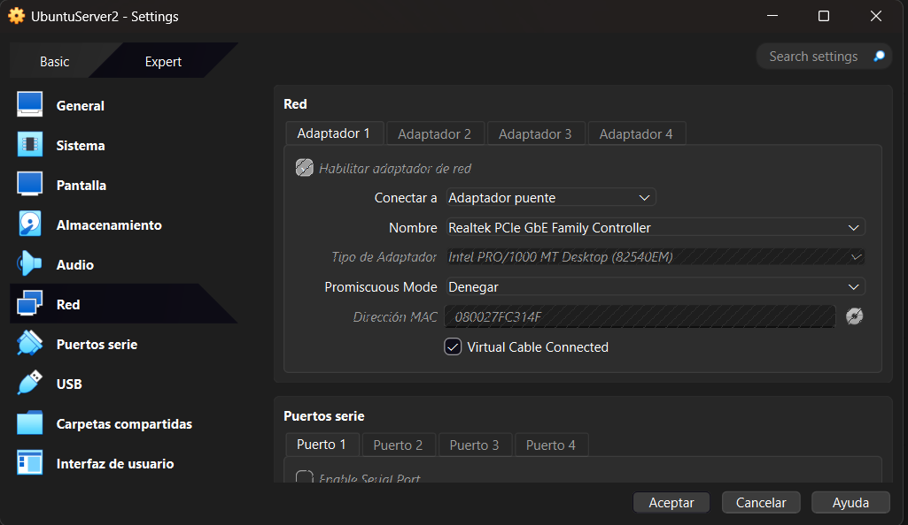
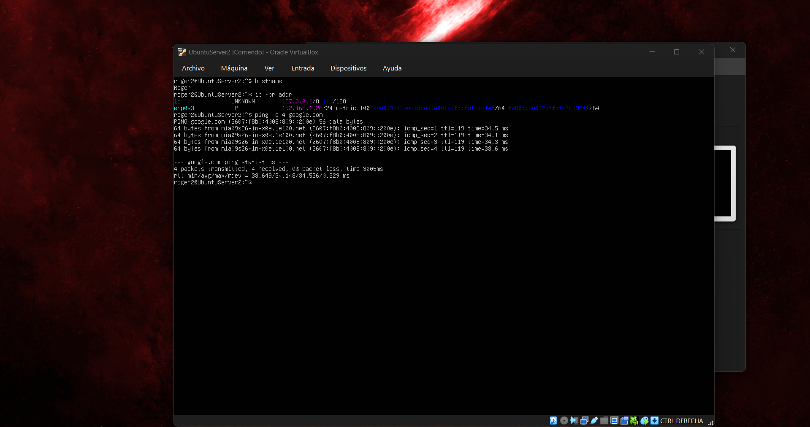
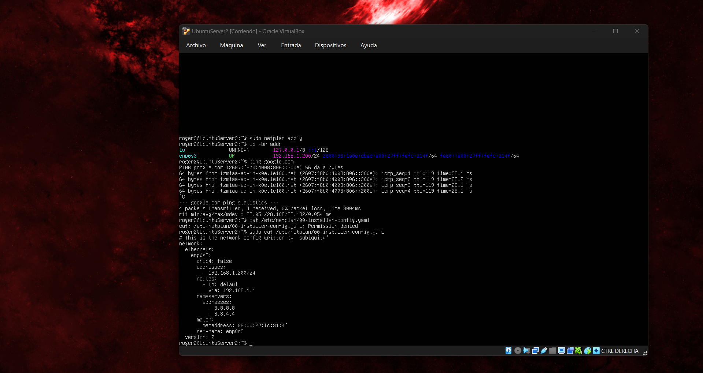
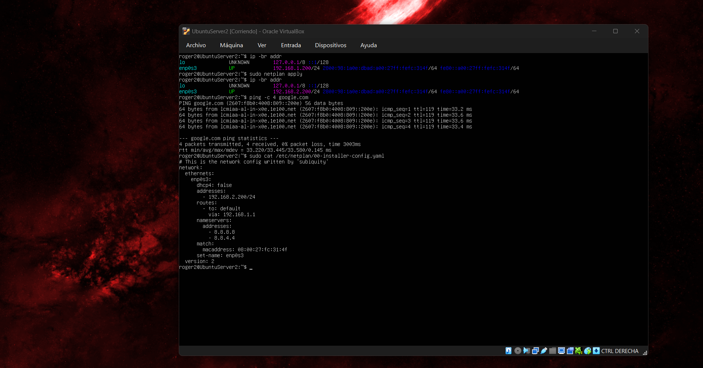

# HW-03 - Modos de red

## Configuración de la máquina virtual

La máquina virtual utiliza **Ubuntu Server** y está configurada en modo **Bridge**.

## Escenario 1 — IP obtenida por DHCP

La VM obtiene automáticamente la IP `192.168.1.26/24` mediante DHCP.

## Escenario 2 — IP manual dentro de la subred

Se asignó manualmente la IP `192.168.1.200/24`, perteneciente a la subred `192.168.1.0/24`.

## Escenario 3 — IP manual fuera de la subred

Se asignó manualmente la IP `192.168.2.200/24`, fuera de la subred `192.168.1.0/24`.

## Subred del hipervisor

La subred del hipervisor es `192.168.1.0/24`, con gateway `192.168.1.1`.

La configuración del adaptador de red del hipervisor se encuentra documentada en la evidencia de la configuración de la máquina virtual.

## Hostname

El hostname de la máquina virtual fue configurado con mi nombre Roger.
