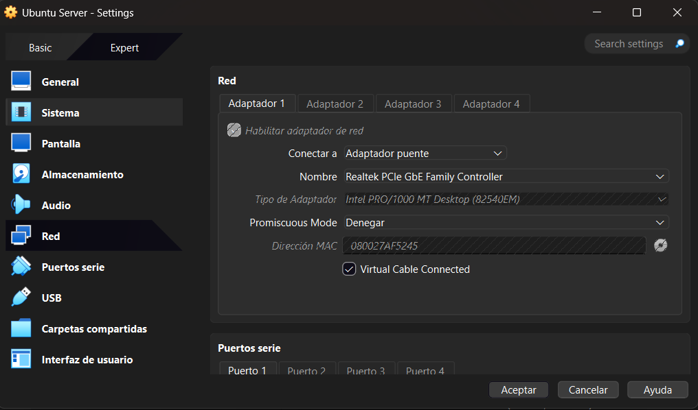
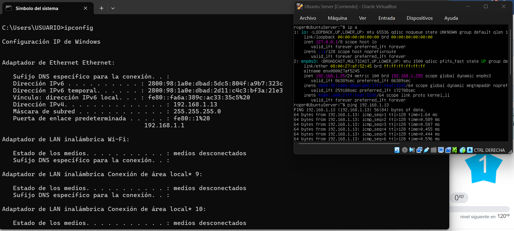

# Comunicación entre Máquina Host y Servidor Virtualizado

## Objetivo

Establecer la comunicación entre la máquina anfitriona (Host) y el servidor virtualizado en VirtualBox, verificando la conectividad mediante el comando `ping`.

## Configuración de VirtualBox

Para que el servidor virtual pudiera pertenecer a la misma subred de la red doméstica, se configuró el adaptador de red de la máquina virtual utilizando el modo **Adaptador Puente (Bridged Adapter)**, permitiendo que el router asignara una dirección IP dentro de la misma red que la máquina anfitriona.



## Verificación de la conectividad

Una vez obtenida una dirección IP dentro de la subred local, se realizó una prueba de conectividad desde el servidor Ubuntu Server hacia la máquina anfitriona utilizando el comando:

```bash
ping <192.168.1.13>
```

La prueba fue exitosa, obteniendo respuestas ICMP desde la máquina física, lo que confirma que existe comunicación entre ambos equipos.


