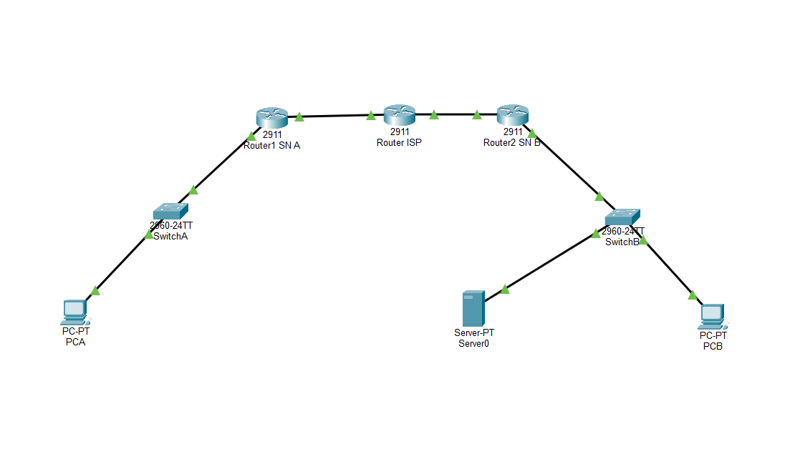
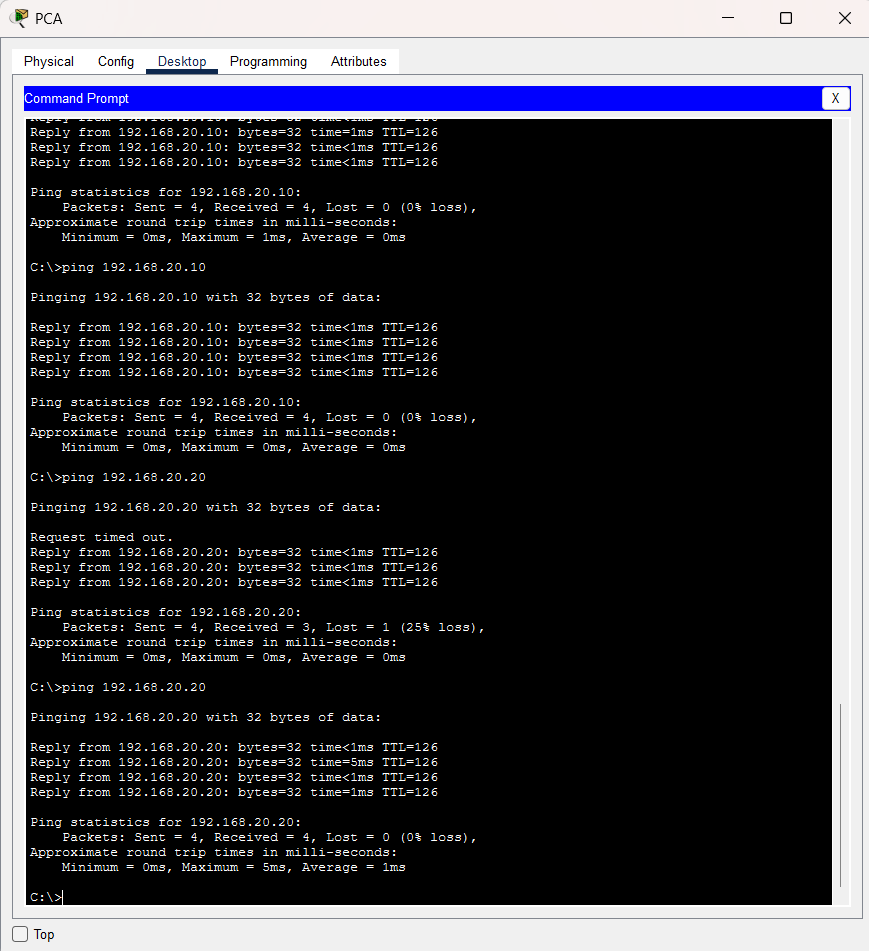
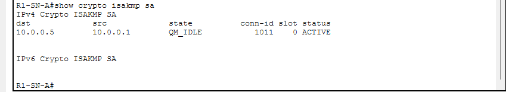
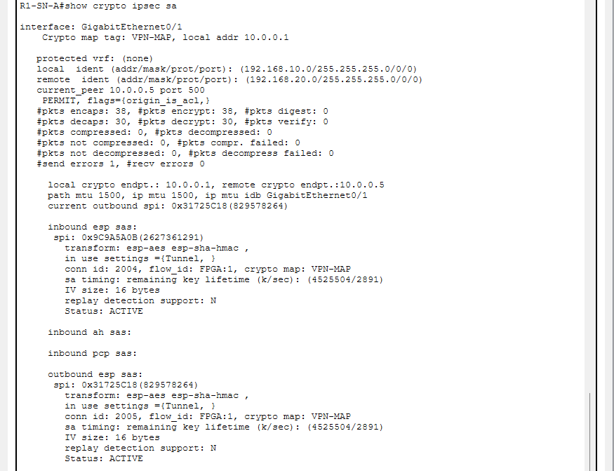
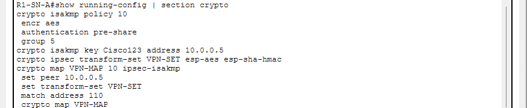
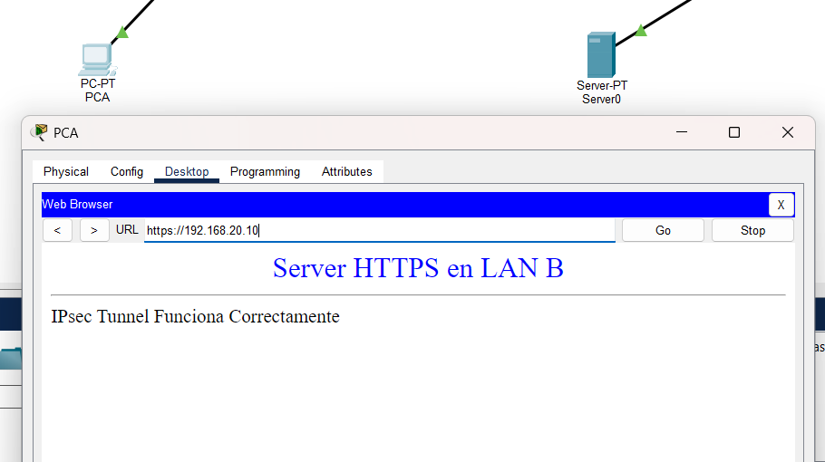

# -Virtualization
 Repository for the virtualization course
# HW-04 — IPSec Tunnel and HTTPS

## Network Topology

The network consists of two different LANs connected through an intermediate router that simulates the Internet.



## Connectivity Tests

Connectivity between the two networks was verified from PC-A using ICMP ping tests.



## IPSec Configuration

A site-to-site IPSec VPN was configured between R1-SN-A and R2-SN-B using tunnel mode.

The IPSec configuration was verified using the following commands:

```text
show crypto isakmp sa
show crypto ipsec sa
show running-config | section crypto
```

### ISAKMP Verification



### IPSec Verification



### IPSec Configuration



## HTTPS Test

An HTTPS request was made from PC-A in the `192.168.10.0/24` network to the web server located at `192.168.20.10` in the opposite network.

The HTTPS service successfully returned the web page.



## Packet Tracer File

The complete Cisco Packet Tracer configuration is available in:

`hw-04.pkt`
