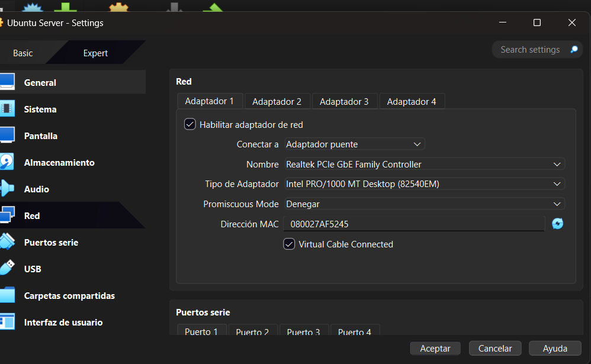
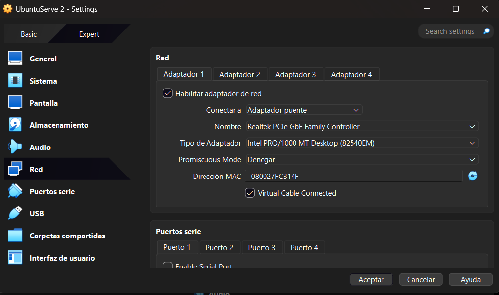
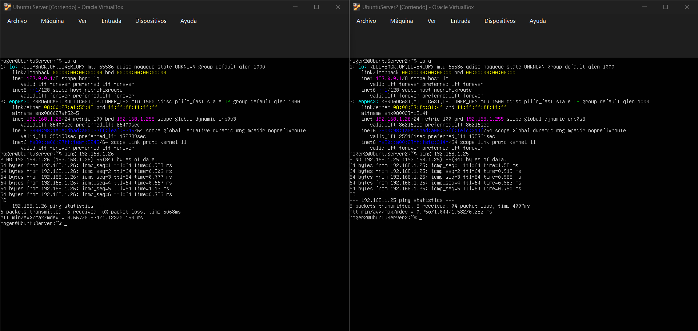

# Comunicación entre Dos Servidores Virtuales

## Objetivo

Configurar dos servidores virtuales en VirtualBox para que pertenezcan a la misma subred de la red doméstica, asignar un nombre de host a cada uno y verificar la comunicación entre ambos mediante el comando `ping`.

## Configuración de los servidores

Se configuraron dos servidores Ubuntu Server utilizando el modo **Adaptador Puente (Bridged Adapter)** en VirtualBox, permitiendo que ambos obtuvieran una dirección IP perteneciente a la misma subred de la red local.

Además, se asignó un nombre de host diferente a cada servidor para facilitar su identificación dentro de la red.

### Servidor 1



### Servidor 2



## Verificación de la comunicación

Una vez configurados ambos servidores, se realizó una prueba de conectividad desde uno de ellos hacia el otro utilizando el comando:

```bash
ping <192.168.1.25>
```
y
```bash
ping <192.168.1.26>
```

La prueba fue exitosa, obteniendo respuestas ICMP, lo que confirma que ambos servidores pueden comunicarse correctamente dentro de la misma subred.


