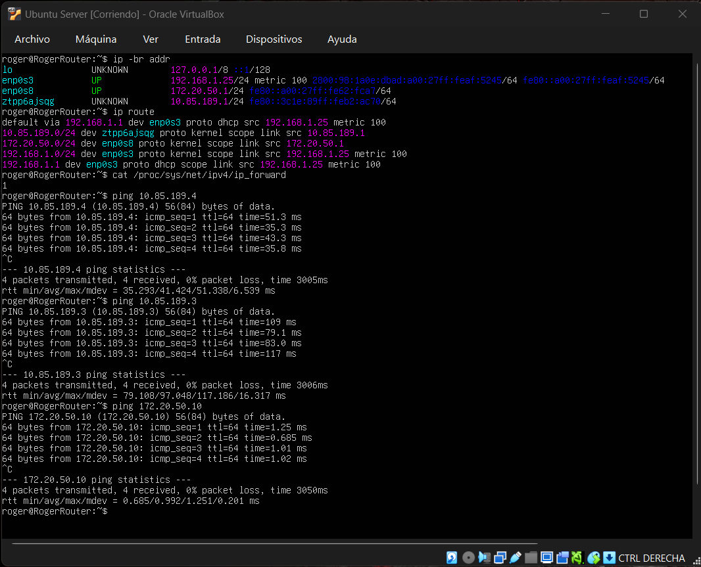
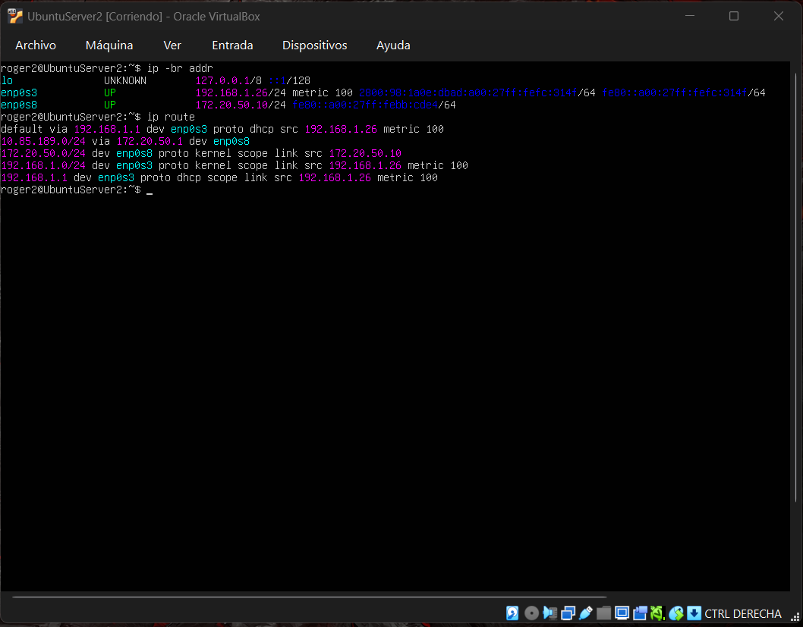
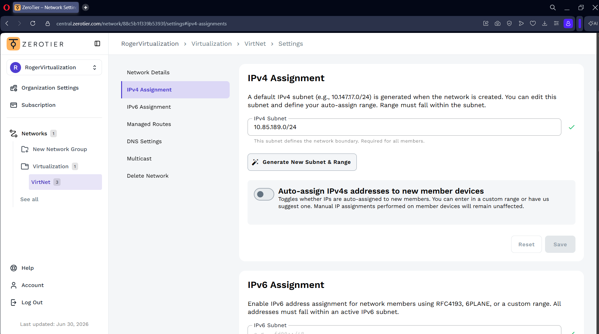
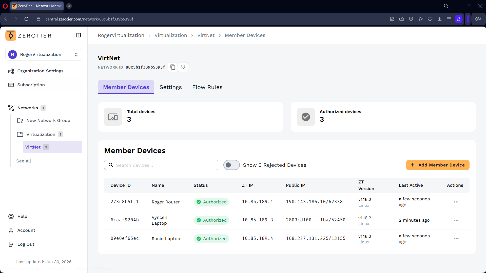
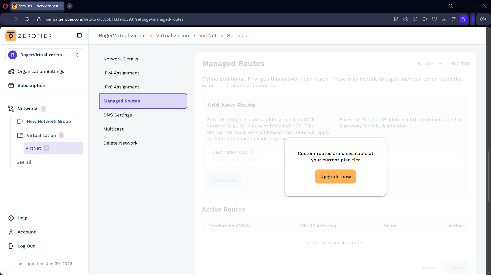
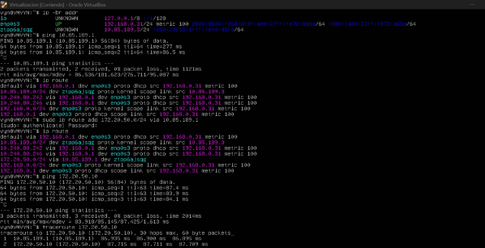
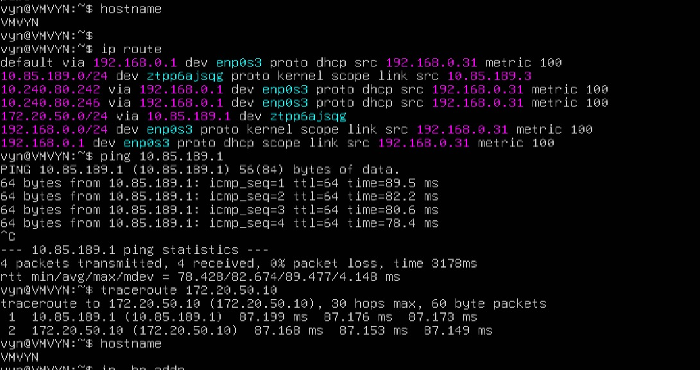
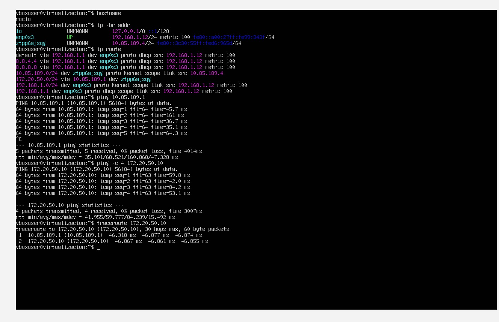

# Virtualization
Repository for the virtualization course

# Assessment 01 - ZeroTier

# Link del Video de YouTube
[Ver video](https://youtu.be/oqCcGyoXD9M)

## Router

### Configuración de ZeroTier

Se configuró el equipo router dentro de la red virtual de ZeroTier.

### Red Interna

Se configuró una red interna en VirtualBox para permitir la comunicación entre el router y la máquina ubicada detrás de este.

---

# Configuración de ZeroTier

### Desactivación de Auto-Assign IPv4

Se deshabilitó la asignación automática de direcciones IPv4 para realizar la asignación de direcciones dentro de la red virtual.

### Dispositivos conectados

Se verificaron los dispositivos conectados y autorizados dentro de la red virtual.

### Managed Routes

Se configuró la ruta administrada necesaria para dirigir el tráfico hacia la red ubicada detrás del router.

---

# Laptop 1

### Configuración de rutas

Se configuró la ruta necesaria para dirigir el tráfico de la red remota a través del router.

### Prueba de conectividad

Se realizó una prueba de ping exitosa para comprobar la comunicación mediante la red virtual.

---

# Laptop 2

### Configuración y prueba de conectividad

Se verificó la configuración de red y la comunicación de Laptop 2 mediante ZeroTier y el router.

---

# Resultado

Se logró interconectar los equipos mediante ZeroTier y configurar un equipo como router para permitir el enrutamiento del tráfico hacia la red interna.