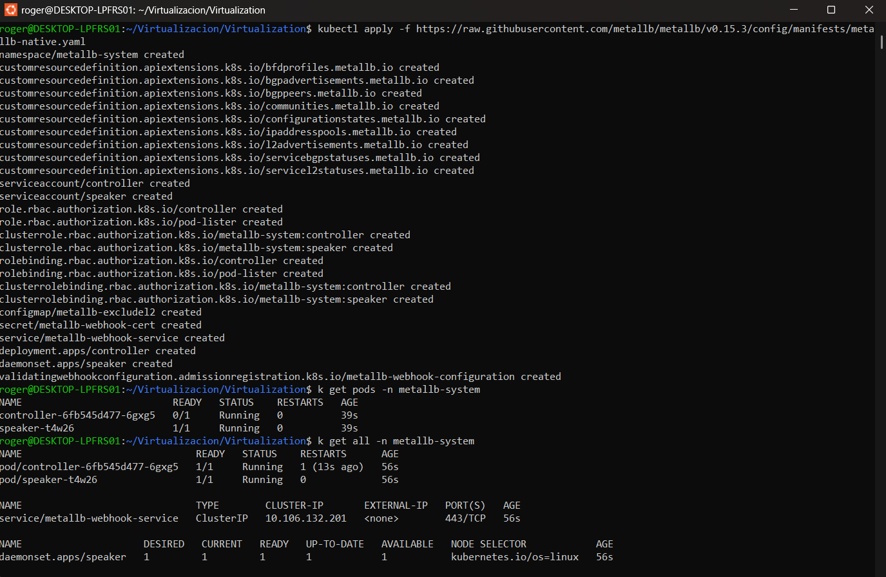
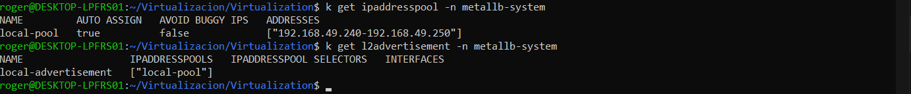
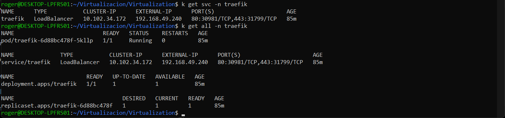
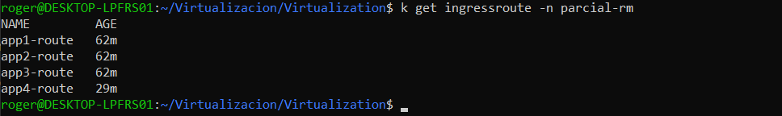
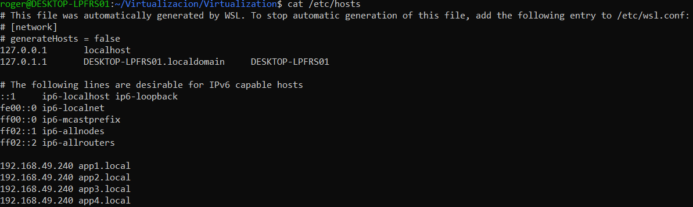
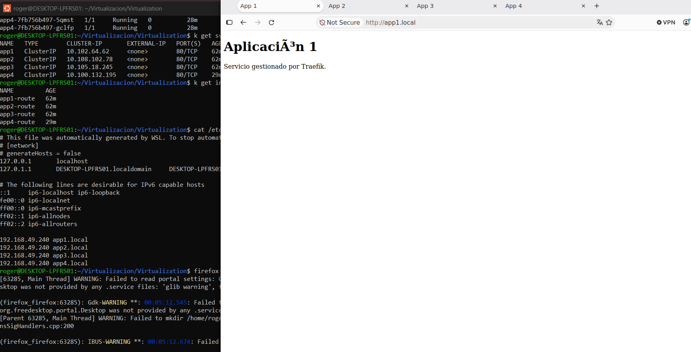
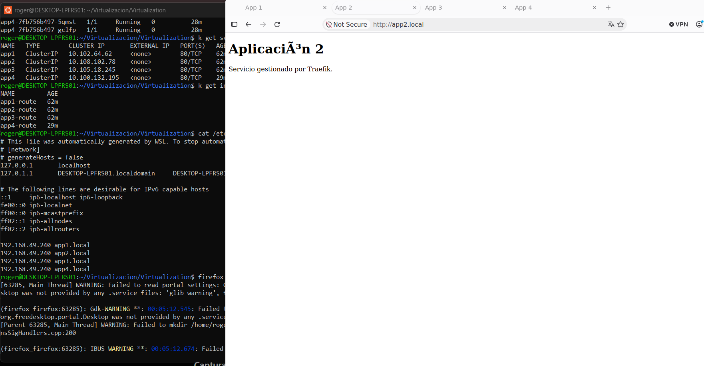
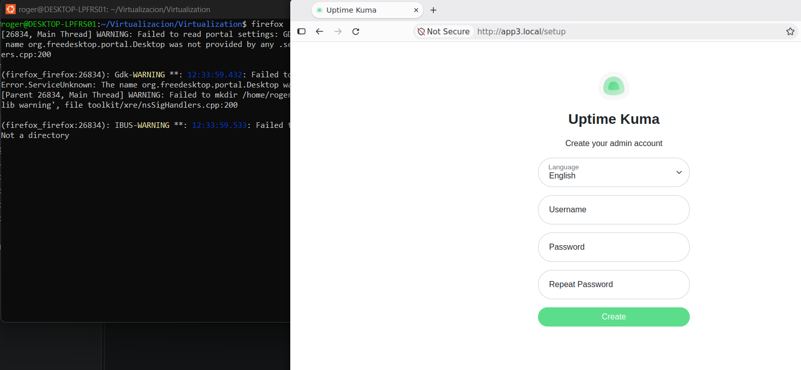
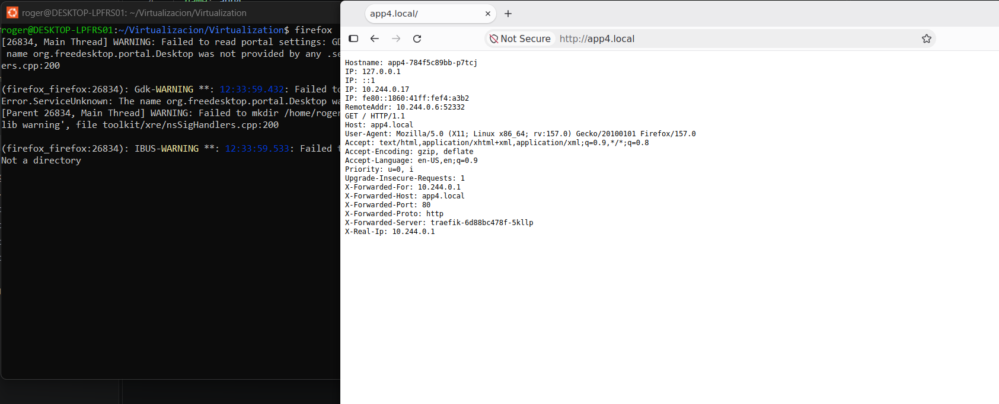

# -Virtualization
 Repository for the virtualization course

# Assessment 02 — Kubernetes, Traefik y MetalLB

Configuración de un clúster local con **Minikube**, **MetalLB** y **Traefik** para publicar cuatro aplicaciones web mediante diferentes dominios.

* **Namespace aplicaciones:** `parcial-rm`
* **Namespace Traefik:** `traefik`
* **Namespace MetalLB:** `metallb-system`
* **IP de Traefik:** `192.168.49.240`

---

## 1. MetalLB

Se configuró MetalLB en el namespace `metallb-system` utilizando un `IPAddressPool` y un `L2Advertisement`.

El rango utilizado fue:

```text
192.168.49.240-192.168.49.250
```





---

## 2. Traefik

Traefik se instaló en el namespace `traefik` y se configuró como `LoadBalancer`.

MetalLB asignó la IP:

```text
192.168.49.240
```



---

## 3. Aplicaciones

Se crearon cuatro aplicaciones web con Nginx dentro del namespace `parcial-rm`.

Cada aplicación cuenta con:

* Deployment
* ConfigMap
* Service `ClusterIP`
* IngressRoute

| Aplicación | Service | Dominio      |
| ---------- | ------- | ------------ |
| `app1`     | `app1`  | `app1.local` |
| `app2`     | `app2`  | `app2.local` |
| `app3`     | `app3`  | `app3.local` |
| `app4`     | `app4`  | `app4.local` |

Los `Deployment` y sus respectivos `ConfigMap` se encuentran definidos en los archivos `deployment.yaml` de cada aplicación.

---

## 4. IngressRoutes

Se configuraron cuatro `IngressRoute` para que Traefik dirija cada dominio hacia su Service correspondiente.



---

## 5. DNS local

Se agregaron los dominios al archivo `/etc/hosts`, todos apuntando a la IP de Traefik:

```text
192.168.49.240 app1.local
192.168.49.240 app2.local
192.168.49.240 app3.local
192.168.49.240 app4.local
```



---

## 6. Configuración de red en WSL

Debido a que el entorno utiliza **WSL2** y Minikube con Docker, fue necesario agregar una ruta hacia la IP asignada por MetalLB para poder acceder desde WSL:

```bash
sudo ip route add 192.168.49.240/32 via 192.168.49.2 dev br-73ee8a88e281
```

La ruta permite que las solicitudes desde WSL lleguen a la IP `192.168.49.240` asignada a Traefik.

---

## 7. Navegador en WSL

Para realizar las pruebas de acceso desde el mismo entorno WSL se instaló **Firefox**:

```bash
sudo apt update
sudo apt install firefox
```

Posteriormente se verificó el acceso a las cuatro aplicaciones mediante sus respectivos dominios.

### App 1



### App 2



### App 3



### App 4



