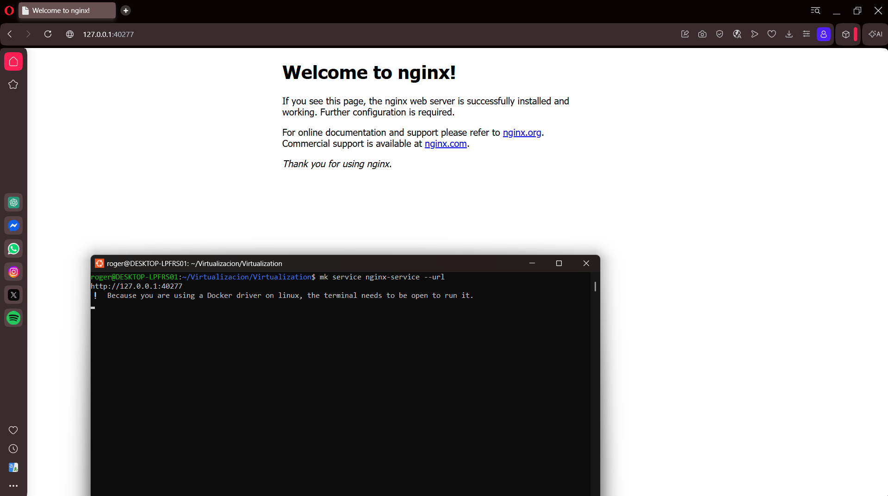
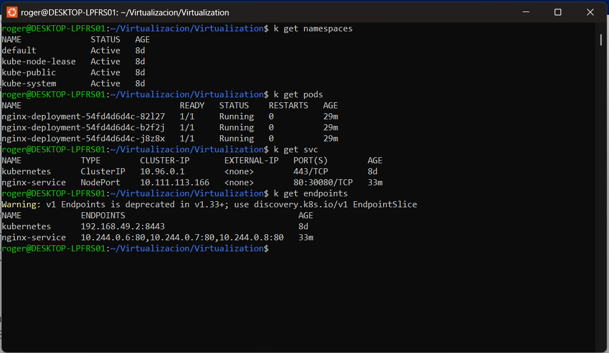

# -Virtualization
 Repository for the virtualization course

# Kubernetes Nginx Service

## Descripción

Configuración de un servicio Nginx utilizando Kubernetes y Minikube.

Se configuró un Deployment de Nginx con 3 réplicas y un Service de tipo NodePort
para permitir el acceso al servicio desde el navegador local.

## Archivos

- `nginx-deployment.yaml`: configuración del Deployment de Nginx.
- `nginx-service.yaml`: configuración del Service de tipo NodePort.

## Servicio

Para consultar el servicio:

```bash
kubectl get svc
```

## Salida:

Acceso desde el navegador



El servicio fue expuesto mediante NodePort y se accedió utilizando:

```bash
minikube service nginx-service --url
```

## Resultados de comandos:


